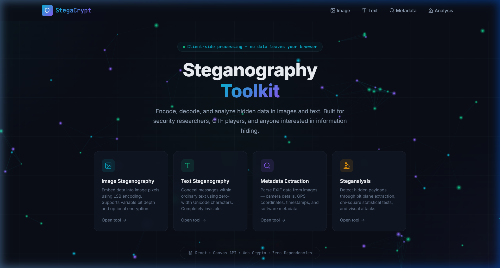
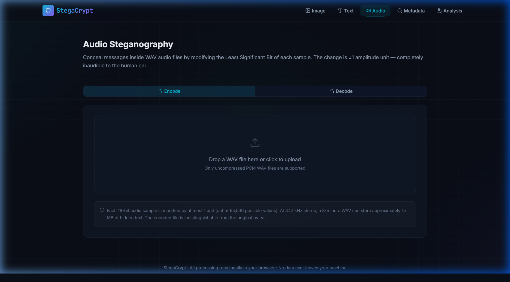

# StegaCrypt — Steganography Toolkit

[](https://opensource.org/licenses/MIT)
[](https://vercel.com/new/clone?repository-url=https://github.com/vx-ux/stegacrypt)

**Live Demo:** [https://stegacrypt.vercel.app](https://stegacrypt.vercel.app) (Replace with your actual Vercel URL once deployed)

A browser-based steganography toolkit for encoding, decoding, and analyzing hidden data in images, text, and audio. All processing runs client-side — no data ever leaves your browser.

Built with React + Vite. Zero backend. Zero external processing dependencies.



## Features

### Image Steganography
- Hide text messages inside image pixels using **LSB (Least Significant Bit)** encoding
- Variable bit depth: 1-bit (invisible), 2-bit (balanced), 4-bit (max capacity)
- Optional **XOR password encryption** for the hidden payload
- Side-by-side original vs. encoded comparison
- Real-time capacity indicator
- Download encoded images as PNG

### Audio Steganography

- Hide text inside **16-bit PCM WAV** audio samples using LSB encoding
- Modification is ±1 amplitude unit (completely inaudible to the human ear)
- Waveform bar chart visualization for side-by-side comparison (original vs. encoded)
- Optional XOR password encryption
- Download encoded audio as a playable WAV file

### Text Steganography
- Conceal messages within ordinary text using **zero-width Unicode characters**
- Characters used: Zero-Width Space (U+200B), Zero-Width Non-Joiner (U+200C)
- Built-in text analyzer to detect hidden zero-width characters
- Visible vs. actual character count comparison

### Metadata Extraction
- Parse **EXIF metadata** from JPEG images (no external libraries)
- Extract camera make/model, exposure settings, ISO, focal length
- GPS coordinate extraction with **OpenStreetMap** preview
- File information: dimensions, size, MIME type

### Steganalysis
- **Bit plane extraction** — visualize individual bit planes per color channel
- **Chi-square statistical test** — detect LSB steganography with confidence scores
- **Histogram analysis** — per-channel pixel value distribution
- **Visual attack** — amplify LSB differences to reveal hidden patterns

## Tech Stack

- **React** — UI components
- **Vite** — Build tooling and dev server
- **Canvas API** — Image pixel manipulation
- **Web Audio API / ArrayBuffer** — Audio sample parsing
- **Web Crypto / XOR** — Payload encryption
- **Zero-width Unicode** — Text steganography
- **Custom EXIF parser** — No external dependencies for metadata extraction

## Getting Started

```bash
# Clone the repository
git clone https://github.com/vx-ux/stegacrypt.git
cd stegacrypt

# Install dependencies
npm install

# Start the dev server
npm run dev
```

The app will be available at `http://localhost:5173/`.

## Project Structure

```
src/
├── components/
│   ├── Icons.jsx            # Inline SVG icon library
│   ├── ImageStego.jsx       # Image steganography UI
│   ├── AudioStego.jsx       # Audio WAV steganography UI
│   ├── TextStego.jsx        # Text steganography UI
│   ├── MetadataViewer.jsx   # EXIF metadata viewer
│   ├── Steganalysis.jsx     # Steganalysis tools UI
│   ├── ErrorBoundary.jsx    # Crash protection component
│   └── ParticleCanvas.jsx   # Cyberpunk hero background animation
├── utils/
│   ├── lsb.js               # LSB encode/decode algorithms (Image)
│   ├── audioStego.js        # WAV parsing and LSB embedding (Audio)
│   ├── textStego.js         # Zero-width character encoding (Text)
│   ├── exif.js              # EXIF metadata parser
│   └── analysis.js          # Bit plane, chi-square, histogram, visual attack
├── App.jsx                  # Main app with navigation
├── main.jsx                 # Entry point
└── index.css                # Design system and styles
```

## How It Works

### Image & Audio LSB Steganography
Both image pixels (RGB channels) and audio samples (16-bit PCM) are represented numerically. The **Least Significant Bit** contributes the smallest amount to the overall value, so changing it is imperceptible to human senses. 

The encoder:
1. Converts the secret message to binary
2. Prepends a magic header (`STCR`) and message length
3. Optionally XOR-encrypts the payload with a password
4. Replaces the LSBs of the host file's data points with message bits

### Zero-Width Text Steganography
Binary data is represented as invisible Unicode characters embedded between visible text:
- `0` → Zero-Width Space (U+200B)
- `1` → Zero-Width Non-Joiner (U+200C)
- Markers (U+FEFF) wrap the hidden payload

The resulting text looks identical when displayed but contains the hidden message.

## License

MIT License - See the [LICENSE](LICENSE) file for details.
