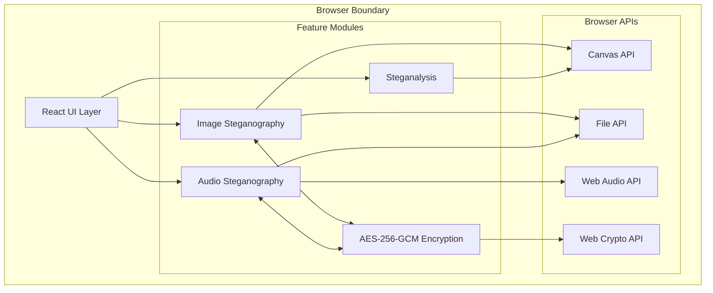
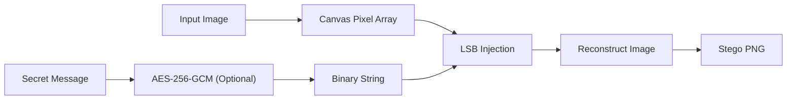
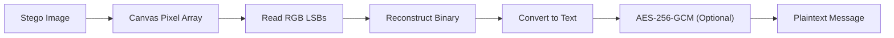
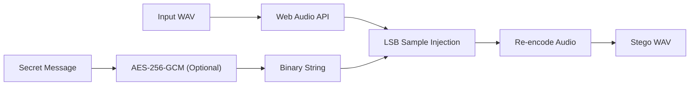
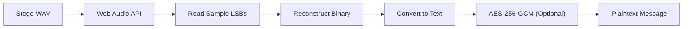
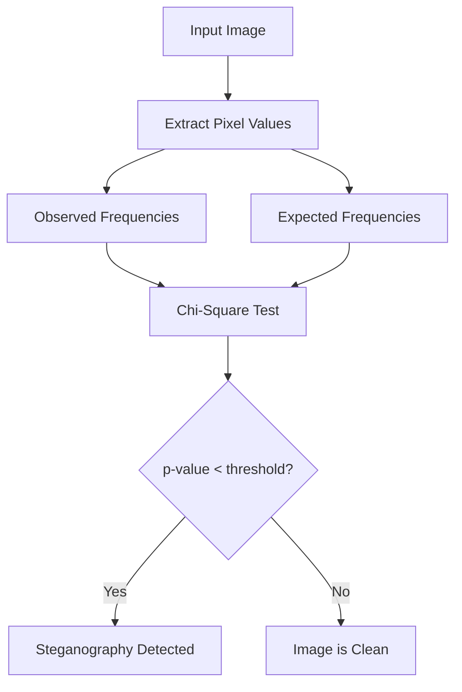
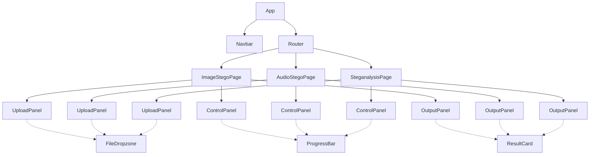

# StegaCrypt

> A browser-based steganography toolkit. No server. No telemetry. No exceptions.


StegaCrypt is a client-side steganography toolkit that runs entirely within the browser. It supports embedding and extracting hidden payloads in image and audio files, optional AES-256-GCM encryption of those payloads, and statistical steganalysis for detecting hidden data. Every operation — file processing, encoding, decryption — executes locally via native browser APIs. Nothing is transmitted externally.

---

## Features

- **LSB Image Steganography** — Embed and extract payloads in PNG and BMP files by manipulating the least significant bits of RGB pixel channels.
- **LSB Audio Steganography** — Conceal and retrieve data within WAV audio files by modifying the least significant bit of individual audio samples.
- **Chi-Square Steganalysis** — Detect the presence of hidden data by testing pixel value distributions against expected natural frequency curves.
- **AES-256-GCM Encryption** — Encrypt payloads before embedding using a PBKDF2-derived key with a random 16-byte salt and 310,000 iterations, providing authenticated confidentiality.
- **Complete Client-Side Execution** — All processing occurs locally via the Canvas API, Web Audio API, Web Crypto API, and File API.

---

## How It Works

**Image Steganography** modifies the least significant bits of the red, green, and blue channels in an image. Because the alterations are confined to the lowest-order bits, the visual difference remains imperceptible to the human eye.

**Audio Steganography** applies the same LSB technique to audio sample bytes within a WAV file. Modifications to the least significant bit of each sample produce amplitude variations that fall below the threshold of human hearing.

**Chi-Square Steganalysis** tests the statistical properties of an image against expected natural distributions. Clean images exhibit typical frequency curves; images containing LSB-encoded data produce unnaturally flat distributions that the test surfaces.

**AES-256-GCM Encryption** wraps the payload in authenticated encryption before it is embedded. The key is derived from a user-supplied password via PBKDF2, ensuring that even if a stego file is discovered, its contents remain confidential and tamper-evident.

---

## Getting Started

### Prerequisites

- Node.js v16 or higher
- npm or yarn

### Installation

```bash
git clone https://github.com/vx-ux/stegacrypt.git
cd stegacrypt
npm install
```

### Running the Application

```bash
npm run dev
```

Navigate to `http://localhost:5173` in your browser.

---

## Usage

### Encoding Data

1. Open the Image or Audio steganography tool.
2. Select the **Encode** mode.
3. Upload a target file — PNG, BMP, or WAV.
4. Enter the payload in the text field.
5. Optionally, provide a password to encrypt the payload with AES-256-GCM.
6. Click **Encode** and download the resulting stego file.

### Decoding Data

1. Open the relevant steganography tool.
2. Select the **Decode** mode.
3. Upload the file containing the embedded payload.
4. Provide the decryption password if the payload was encrypted.
5. Click **Decode** to extract the hidden message.

---

## System Architecture & Workflows

### High-Level System Architecture



The React UI orchestrates four isolated feature modules. Each module communicates exclusively with native browser APIs — no external dependencies, no network calls.

---

### LSB Image Encoding Flow



The input image is decoded into a raw pixel array. The payload — optionally encrypted — is converted to binary and injected into the least significant bits of RGB channel values before the image is re-encoded.

---

### LSB Image Decoding Flow



The stego image is decoded into its pixel array. LSBs are read from the RGB channels, reconstructed into a binary string, and converted back to text. If the payload was encrypted, decryption is applied as the final step.

---

### LSB Audio Encoding Flow



The WAV file is decoded into raw audio samples via the Web Audio API. The payload binary is injected into the least significant bit of each sample before the audio is re-encoded and exported.

---

### LSB Audio Decoding Flow



The stego WAV is decoded into its audio samples. The least significant bit of each sample is read and assembled into a binary string, which is then converted to text and decrypted if a password was provided.

---

### Chi-Square Steganalysis Flow



Observed pixel frequency distributions are compared against expected natural distributions. A p-value below the significance threshold indicates the presence of artificially injected data.

---

### Component Tree



Each feature page follows an identical three-panel layout — upload, control, output — and shares common UI primitives via dotted references.

---

## Project Structure

```text
src/
├── components/       # React UI components
├── utils/            # Steganography, cryptography, and analysis logic
├── workers/          # Web Workers for off-thread processing
├── App.jsx           # Main application component
├── index.css         # Global stylesheets
└── main.jsx          # React entry point
```

---

## Security

StegaCrypt operates entirely within the client environment. No files, passwords, or payloads are transmitted to any external server. All processing is handled by the Canvas API, Web Audio API, and Web Crypto API.

When a password is supplied, the payload is encrypted with AES-256-GCM before embedding. The encryption key is derived via PBKDF2 using a randomly generated 16-byte salt and 310,000 iterations. This scheme provides authenticated encryption, guaranteeing both the confidentiality and integrity of the hidden payload.

---

## Built For

Nebula — a code-a-thon organized by [MDG Space](https://mdgspace.org), IIT Roorkee.

---

## License

[MIT](./LICENSE)
