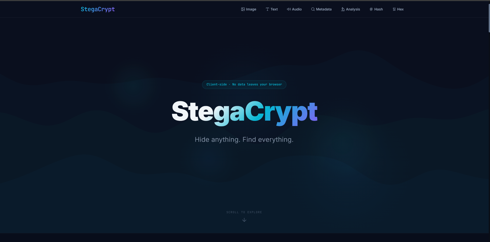

# StegaCrypt

> A browser-based steganography toolkit. No server. No telemetry. No exceptions.


**[Live Demo](https://stegacrypt-5ocemg0zx-vx-uxs-projects.vercel.app/)**



StegaCrypt is a client-side steganography toolkit that runs entirely within the browser. It supports embedding and extracting hidden payloads in image and audio files, optional AES-256-GCM encryption of those payloads, and statistical steganalysis for detecting hidden data. Every operation executes locally via native browser APIs. Nothing is transmitted externally.

---

## Features

- **LSB Image Steganography**: Embed and extract payloads in PNG and BMP files by manipulating the least significant bits of RGB pixel channels.
- **LSB Audio Steganography**: Conceal and retrieve data within WAV audio files by modifying the least significant bit of individual audio samples.
- **Chi-Square Steganalysis**: Detect the presence of hidden data by testing pixel value distributions against expected natural frequency curves.
- **AES-256-GCM Encryption**: Encrypt payloads before embedding using a PBKDF2-derived key with a random 16-byte salt and 310,000 iterations.
- **Client-Side Execution**: All processing occurs locally via the Canvas API, Web Audio API, Web Crypto API, and File API.

---

## How It Works

### System Overview

The React UI routes user actions to one of four independent modules. Each module relies exclusively on native browser APIs and does not communicate with any external service.


---

### Image Steganography

The encoder reads the image into a pixel array via the Canvas API, converts the payload to binary, and overwrites the least significant bit of each RGB channel value. The alteration is visually imperceptible. The decoder reverses this process by reading those same bits back out.

**Encoding**


**Decoding**


---

### Audio Steganography

The encoder decodes the WAV file into raw audio samples via the Web Audio API and modifies the least significant bit of each sample. The change in amplitude falls below the threshold of human hearing. Decoding reads those bits back and reconstructs the original message.

**Encoding**


**Decoding**


---

### Chi-Square Steganalysis

The module extracts pixel values from the uploaded image and compares their frequency distribution against what a natural, unmodified image would produce. LSB-encoded images exhibit an unnaturally flat distribution. A chi-square test quantifies the deviation and returns a verdict.


---

### AES-256-GCM Encryption

When a password is provided, the payload is encrypted before embedding and decrypted after extraction. The encryption key is derived from the password via PBKDF2 with a random 16-byte salt and 310,000 iterations. This step is optional but recommended for sensitive payloads.

---

## Getting Started

### Prerequisites

- Node.js v16 or higher
- npm or yarn

### Installation

```bash
git clone https://github.com/vx-ux/stegacrypt.git
cd stegacrypt
npm install
```

### Running the Application

```bash
npm run dev
```

Navigate to `http://localhost:5173` in your browser.

---

## Usage

### Encoding Data

1. Open the Image or Audio steganography tool.
2. Select the **Encode** mode.
3. Upload a target file (PNG, BMP, or WAV).
4. Enter the payload in the text field.
5. Optionally, provide a password to encrypt the payload with AES-256-GCM.
6. Click **Encode** and download the resulting stego file.

### Decoding Data

1. Open the relevant steganography tool.
2. Select the **Decode** mode.
3. Upload the file containing the embedded payload.
4. Provide the decryption password if the payload was encrypted.
5. Click **Decode** to extract the hidden message.

---

## Project Structure

```text
src/
├── components/       # React UI components
├── utils/            # Steganography, cryptography, and analysis logic
├── workers/          # Web Workers for off-thread processing
├── App.jsx           # Main application component
├── index.css         # Global stylesheets
└── main.jsx          # React entry point
```

---

## Security

StegaCrypt operates entirely within the client environment. No files, passwords, or payloads are transmitted to any external server. All processing is handled by the Canvas API, Web Audio API, and Web Crypto API.

When a password is supplied, the payload is encrypted with AES-256-GCM before embedding. The encryption key is derived via PBKDF2 using a randomly generated 16-byte salt and 310,000 iterations. This scheme provides authenticated encryption, guaranteeing both the confidentiality and integrity of the hidden payload.

---

## License

[MIT](./LICENSE)
